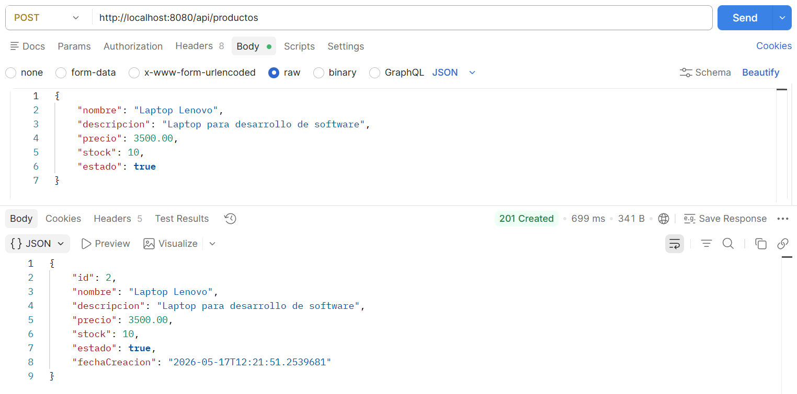
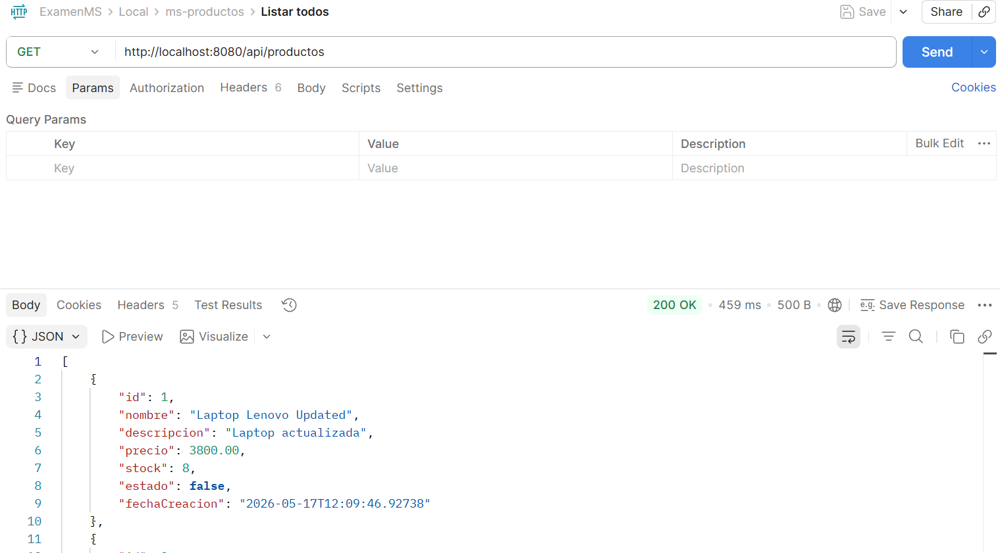
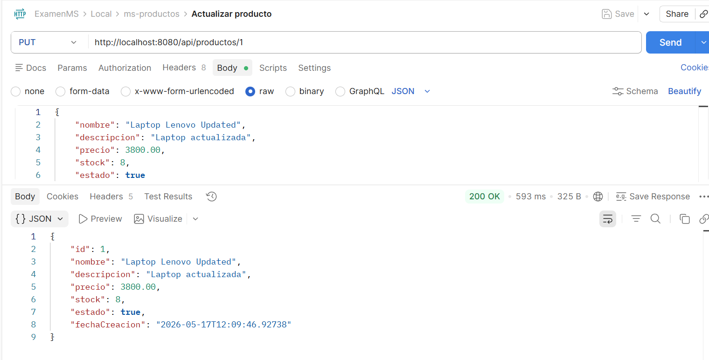
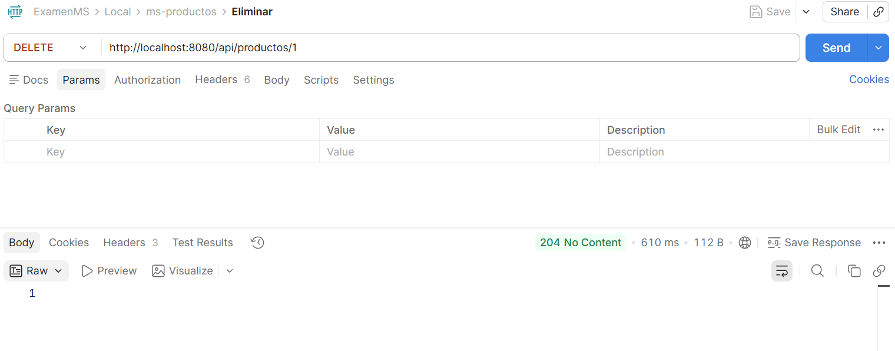
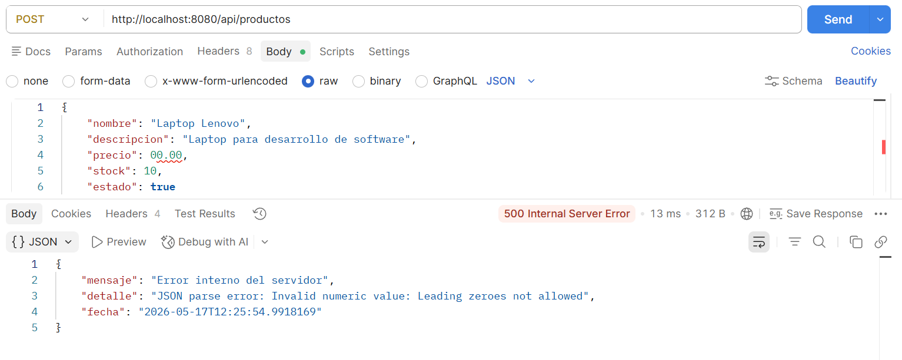

# ms-productos

## 1. Nombre del microservicio

**ms-productos**

---

## 2. Descripción breve del microservicio

Microservicio encargado de la gestión de productos.

Permite realizar operaciones CRUD:

- Crear productos
- Listar productos
- Buscar productos por ID
- Actualizar productos
- Actualizar productos
- Eliminar productos

Este servicio está desarrollado con arquitectura basada en microservicios usando Spring Boot.

---

## 3. Tecnologías utilizadas

| Tecnología | Descripción |
|---|---|
| Java 17 | Lenguaje principal del proyecto |
| Spring Boot | Framework para desarrollo backend |
| PostgreSQL | Base de datos relacional |
| Neon | Servicio cloud de PostgreSQL |
| Docker | Contenerización de la aplicación |
| Render | Plataforma de despliegue cloud |

---

## 4. Endpoints disponibles

| Método | Endpoint | Descripción |
|---|---|---|
| POST | `/api/productos` | Crear un nuevo producto |
| GET | `/api/productos` | Listar todos los productos |
| GET | `/api/productos/{id}` | Obtener un producto por ID |
| PUT | `/api/productos/{id}` | Actualizar un producto |
| DELETE | `/api/productos/{id}` | Eliminar un producto |

---

## 5. Variables de entorno necesarias

| Variable | Descripción |
|---|---|
| DB_URL | URL de conexión a PostgreSQL |
| DB_USERNAME | Usuario de la base de datos |
| DB_PASSWORD | Contraseña de la base de datos |
| PORT | Puerto donde se ejecutará el servicio |

---

## 6. Instrucciones para ejecutar en local

### Requisitos previos

- Java 17 instalado
- Maven instalado
- PostgreSQL disponible
- Git instalado

### Pasos

1. Clonar el repositorio

## 7. Evidencias
Crear producto

Listar productos

Buscar por ID

Actualizar producto

Eliminar producto

Mala Peticion

Tabla en Neon

9. URL del servicio desplegado
   https://ms-productos-xxxx.onrender.com


---
Despliegue
```8. bash
git clone https://github.com/usuario/ms-productos.git

Ingresar al proyecto

cd ms-productos

Configurar las variables de entorno

Compilar el proyecto

mvn clean install

Ejecutar el microservicio

mvn spring-boot:run


