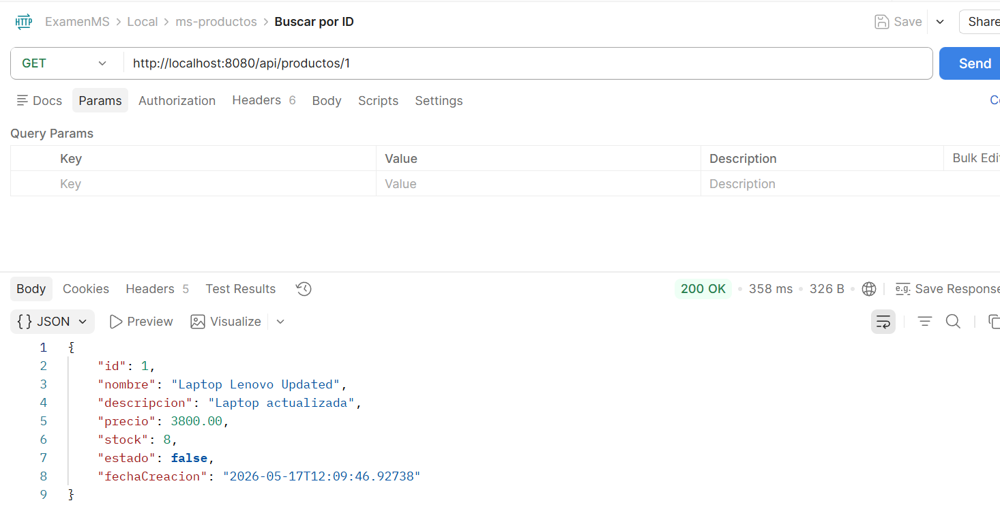
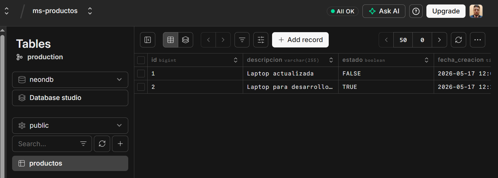
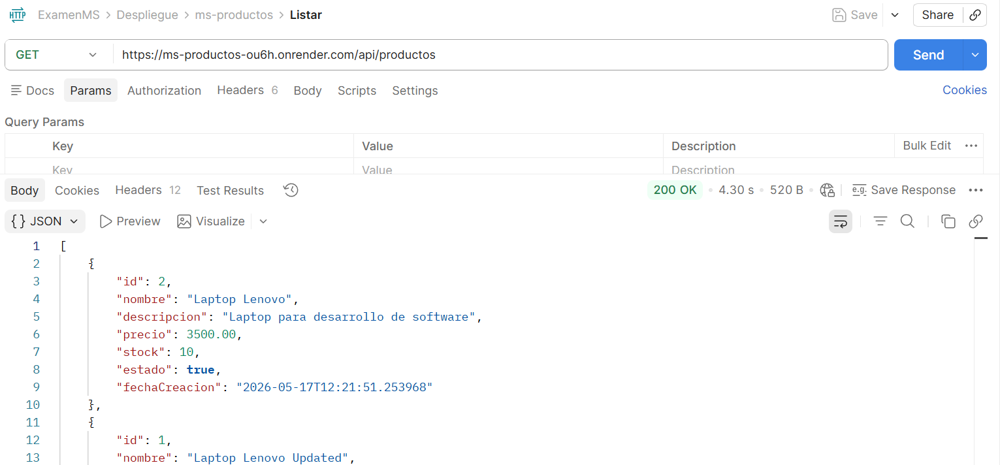
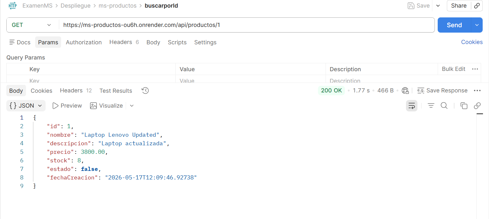
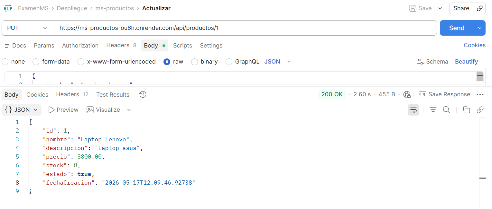
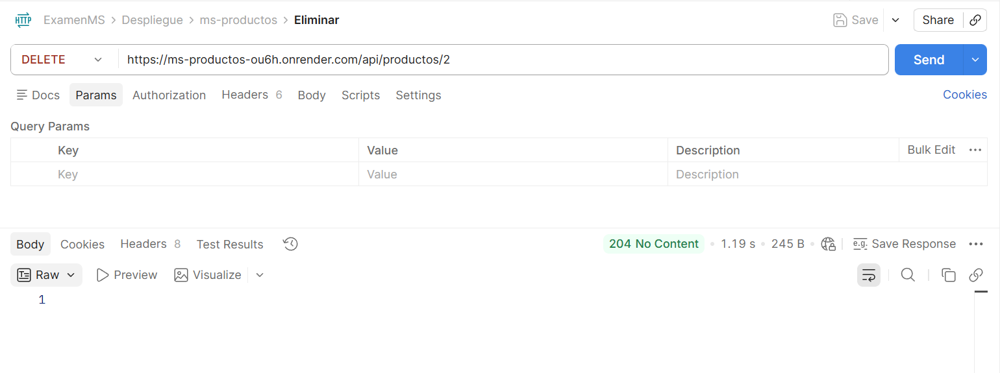
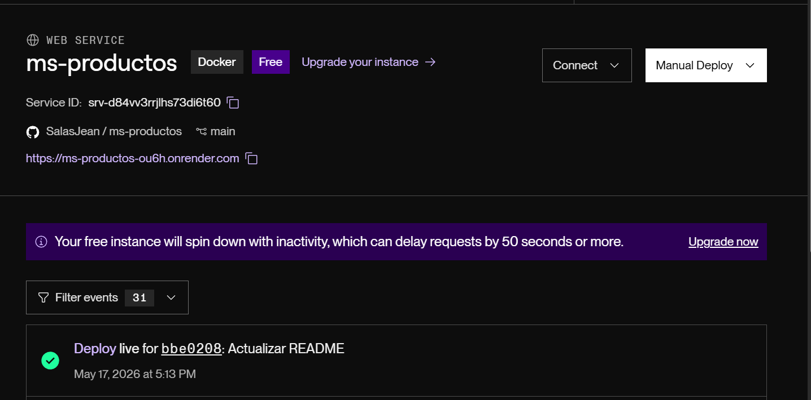

# ms-productos

## 1. Nombre del microservicio

**ms-productos**

---

## 2. Descripción

Microservicio encargado de la gestión de productos. Expone una API REST que permite realizar las siguientes operaciones CRUD:

- Crear productos
- Listar productos
- Buscar productos por ID
- Actualizar productos
- Eliminar productos

El servicio está desarrollado bajo una arquitectura de microservicios con Spring Boot.

---

## 3. Tecnologías utilizadas

| Tecnología | Descripción |
|---|---|
| Java 17 | Lenguaje principal del proyecto |
| Spring Boot | Framework para desarrollo backend |
| PostgreSQL | Base de datos relacional |
| Neon | Servicio cloud de PostgreSQL |
| Docker | Contenerización de la aplicación |
| Render | Plataforma de despliegue cloud |

---

## 4. Endpoints disponibles

| Método | Endpoint | Descripción |
|---|---|---|
| POST | `/api/productos` | Crear un nuevo producto |
| GET | `/api/productos` | Listar todos los productos |
| GET | `/api/productos/{id}` | Obtener un producto por ID |
| PUT | `/api/productos/{id}` | Actualizar un producto |
| DELETE | `/api/productos/{id}` | Eliminar un producto |

---

## 5. Variables de entorno necesarias

| Variable | Descripción |
|---|---|
| `DB_URL` | URL de conexión a PostgreSQL |
| `DB_USERNAME` | Usuario de la base de datos |
| `DB_PASSWORD` | Contraseña de la base de datos |
| `PORT` | Puerto donde se ejecutará el servicio |

---

## 6. Instrucciones para ejecución en local

### Requisitos previos

- Java 17 instalado
- Maven instalado
- PostgreSQL disponible
- Git instalado

### Pasos

1. Clonar el repositorio:

   ```bash
   git clone https://github.com/usuario/ms-productos.git
   ```

2. Ingresar al directorio del proyecto:

   ```bash
   cd ms-productos
   ```

3. Configurar las variables de entorno necesarias.

4. Compilar el proyecto:

   ```bash
   mvn clean install
   ```

5. Ejecutar el microservicio:

   ```bash
   mvn spring-boot:run
   ```

---

## 7. URL del servicio desplegado

https://ms-productos-ou6h.onrender.com
---

## 8. Evidencias

### Crear producto


### Listar productos


### Buscar producto por ID


### Actualizar producto


### Eliminar producto


### Petición incorrecta


### Tabla de productos en Neon



## 9. Evidencias ya Desplegada

### Listar productos


### Buscar producto por ID


### Actualizar producto


### Eliminar producto

### Despliegue en render

